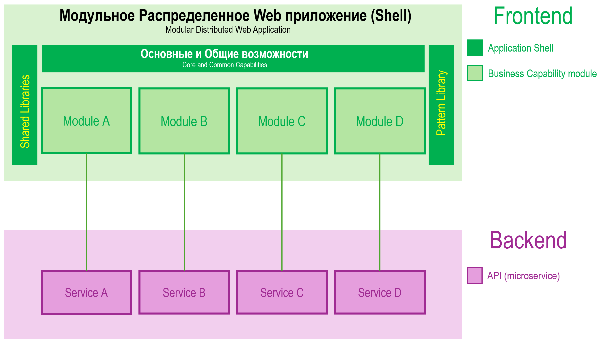
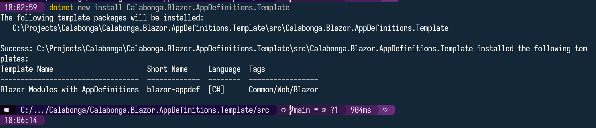
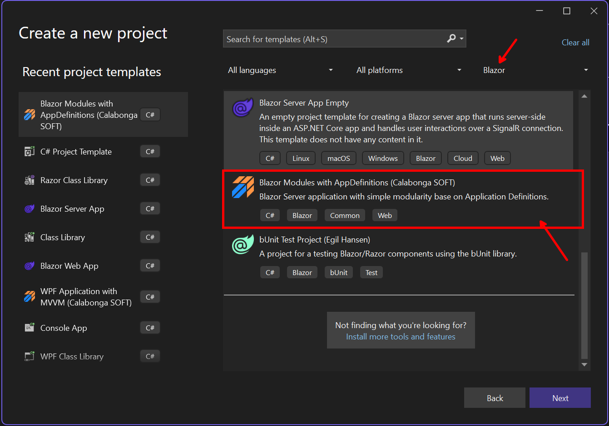

# Calabonga.Blazor.AppDefinitions.Template

## Описание

Модульный монолит на Blazor? Легко! `Calabonga.Blazor.AppDefinitions.Template` - пример такого приложения, которое содержит модули (Components) в отдельных проектах (в отдельных сборках). Для это используется nuget-пакет [Calabonga.Blazor.AppDefinitions](https://www.nuget.org/packages/Calabonga.Blazor.AppDefinitions/). 

Сборка [Calabonga.Blazor.AppDefinitions.Template](https://github.com/Calabonga/Calabonga.Blazor.AppDefinitions.Template) является шаблоном для Visual Studio (Rider), который позволит "на лету" создать решения на базе модульного приложения на Blazor (Shell + Plugins).

В сборку `Calabonga.Blazor.AppDefinitions` содержит контракты и прочие артефакты, необходимые для работы модульности.

## Возможный вариант архитектуры

В шаблоне решения реализована схема показанная ниже (часть frontend), на базе nuget-пакета `Calabonga.Blazor.AppDefinitions`. Модули на frontend работают с микросервисами на backend. Причем, можно позволить модулям UI "ходить" в разные сервисы на стороне backend.



## Как установить

Чтобы установить шаблон для Visual Studio, Rider и dotnet CLI (сразу для всех) выполните команду в командной строке (Terminal/Powershell):

``` powershell
dotnet new install Calabonga.Blazor.AppDefinitions.Template
```

Результат выполнения будет примерно такой:



После успешной установки можно найти новый шаблон в visual Studio, а также в JetBrains Rider и даже в dotnet CLI



## Как удалить шаблон

Чтобы удалить шаблон из списка шаблонов для Visual Studio, Rider и dotnet CLI выполните команду в командной строке (Terminal/Powershell):

``` powershell
dotnet new uninstall Calabonga.Blazor.AppDefinitions.Template
```

Результат выполнения будет примерно такой:


## Nuget-пакеты

* [Calabonga.Blazor.AppDefinitions.Template](https://www.nuget.org/packages/Calabonga.Blazor.AppDefinitions.Template/) - nuget-пакет, установка которого добавит в список шаблонов новый шаблон `Calabonga.Blazor.Shell`. Этот шаблон создает проект Blazor Server приложения как основа для модульного монолита (Shell). Шаблон работает и для Visual Studio, и для JetBrains Rider, и для dotnet CLI. (nuget-package as tool)
* [Calabonga.Blazor.AppDefinitions](https://www.nuget.org/packages/Calabonga.Blazor.AppDefinitions/) - nuget-пакет (этот репозиторий), который собой представляет набор контактов для использования в модулях и в основном приложении. (nuget-package as usual)

## Запуск приложение созданного из шаблона

1. После того, как вы создали новое решение используя указанный выше шаблон, обратите внимание, на папку `Modules`, она должна быть пустая. 
2. Чтобы модули появились в папке `Modules`, нужно пересобрать (rebuild) каждый из них, или всё сразу, в том числе с приложением, запустив процесс командой `Rebuild`. После успешной сборки, модули копируются в папку `Modules` автоматически (см. настройки *.csproj в каждом из модулей).
3. Если модули копирован успешно, проект можно запускать (Visual Studio кнопка F5 по умолчанию). После запуска вы увидите стандартное приложение из шаблона, но при этом состоящее из модулей.

## Description
 
This is a demo Application Modular Blazor application. All pages moved to the its own project in one solution, but those projects (modules) are not linked with main Shell project as reference. Just install package and try it.

## История версий

### Версия 1.2.0 2024-11-10

* В обновлении добавлена возможность сортировки модулей, а также возможность скрывать их из меню при необходимости. (сборка `Calabonga.Blazor.AppDefinitions` обновлена)
* Дополнена инструкция по использованию шаблона решения.

### Версия 1.1.0 2024-11-08

* Улучшена сборка метаданных с модулей (Metadata from blazor modules improved).
* Меню теперь генерируется на основе списка модулей, то есть динамически (Menu dynamic generation implemented).

### Версия 1.0.0 2024-11-07

* Первый релиз сборки (first release).